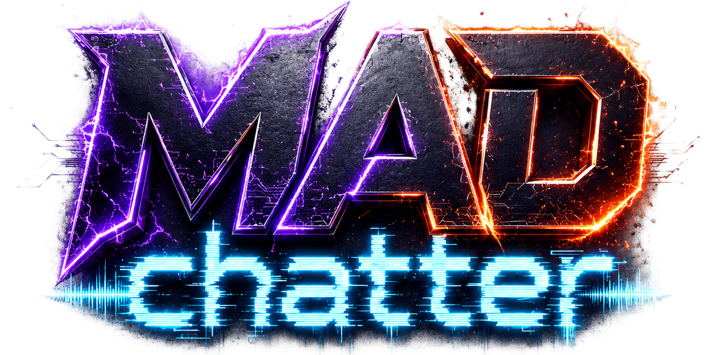

<p align="center">
  
</p>

<h1 align="center">MADchatter</h1>

<p align="center"><strong>Read the room. Forge the reply.</strong><br>
An AI chat co-pilot for Twitch, Kick, and Joystick streams.</p>

<p align="center">Created by <strong>Deffy Urz</strong> · Released under the <a href="LICENSE">MIT License</a></p>

<p align="center">
  <a href="#what-you-can-do">Explore the features</a> ·
  <a href="#get-started">Get started</a> ·
  <a href="docs/SETUP.md">Setup guide</a> ·
  <a href="CHANGELOG.md">Changelog</a>
</p>

[](https://madchatter.fun/ss1.png)

MADchatter brings live chat, audio transcripts, screen snapshots, and remembered context into one workspace for writing stream chat messages. Generate a batch, tune the voice, refine a reply, and choose what to send—or enable **AutoForge** to let the app decide when to speak and when to stay quiet.

Built for streamers and bot operators who want control over their bot's personality, context, and participation. Bring your own AI provider key or connect a local model through Ollama.

**Project status:** actively developed. Desktop Chrome or Edge is the intended environment. Platform integrations and advanced modes have different capabilities; see [platform support](#platform-support) and [multi-bot mode](#multi-bot-mode).

## What you can do

| Capability | In practice |
| --- | --- |
| **Forge replies** | Generate several chat-message variants from the available stream context, then refine, copy, or send your choice. |
| **Shape the voice** | Adjust persona, humor, chaos, emote density, message length, and directives in the Tuning Deck. **R34L** adds a looser typing style informed by recent chat. |
| **Let AutoForge participate** | Use autonomous decisions, confidence thresholds, pacing controls, and a decision log. Start in Dry Run to inspect decisions before enabling automatic sends. |
| **Bring the stream into context** | Combine chat and stream metadata with optional audio transcription and visual snapshots. Include pinned context and a priority Golden Memory. |
| **Remember recurring context** | Extract memories, user profiles, and inside jokes, with personality context stored between sessions in the browser. |
| **Respond to mentions** | Review smart-reply suggestions when someone addresses the bot. |
| **Run multiple identities** | Give Twitch or Kick bots distinct personas and coordinate autonomous turns from one workspace. See the current scope below. |
| **See what happened** | Inspect the AutoForge HUD, action history, sentiment trends, chat activity, and analytics. |

The workspace also includes rule presets, session goals, action sequences, visual snapshot history, browser or ElevenLabs speech output, a guided tour, resizable panels, and three themes: **Default**, **CosmoTech**, and **Corrupture**. Emote context draws on **7TV**, **FrankerFaceZ**, and **BetterTTV**.

## Two ways to use it

### Forge: you choose the message

1. Connect a platform account and choose the channel.
2. Configure an AI provider and adjust the persona in the Tuning Deck.
3. Add stream capture and any context you want the bot to use.
4. **Forge** a batch, review the variants, and refine or send your selection.

### AutoForge: you set the boundaries

1. Establish the channel, account, provider, and context first.
2. Open the **AutoForge HUD** and turn on **Dry Run** before enabling AutoForge.
3. Inspect the decisions, reasons, and confidence values. Adjust the voice, pacing, and threshold.
4. Turn Dry Run off when you are ready for autonomous messages to reach chat.

AutoForge includes rate controls, duplicate checks, and anti-repetition context. These help manage participation; use the bot in channels where you have permission and review its behavior as the conversation changes.

> **Dry Run suppresses AutoForge sends.** It can still make AI calls, and manual sends remain live. It is useful for rehearsing autonomous decisions, but it is not a no-cost or fully simulated session.

## Get started

You will need:

- **Node.js 22.12 or newer** and npm for this checkout's tooling.
- A **desktop browser**; the app is designed around Chrome and Edge, screen capture, and keyboard controls.
- An AI provider key, or **Ollama** running a local model.
- A supported platform account to send messages to chat.

From a terminal:

```sh
git clone https://github.com/Defients/MADchatter.git
cd MADchatter
npm ci
npm run dev
```

Open the local URL printed by Vite, normally `http://localhost:5173`.

In the app:

1. Open **Settings → API Config**, select a provider, enter its key, and click **Save Keys**. For Ollama, configure its endpoint and model instead.
2. Choose **Twitch**, **Kick**, or **Joystick**, connect the intended account, and set the channel.
3. Use **Capture** to select the stream tab or screen. Enable audio sharing in the browser chooser if you want stream transcription, then configure transcription as needed.
4. Follow the Forge setup checklist and generate your first batch. Keep AutoForge off while you get familiar with the controls.

**AI keys for the browser app are configured in Settings.** Setting `GEMINI_API_KEY` in an environment file does not populate the browser's provider settings.

**Local startup and independent hosting are different setups.** The current browser login flows use project-hosted callback pages and default external token proxies. Running locally does not replace those services. See the [setup guide](docs/SETUP.md) for provider configuration, backend details, OAuth dependencies, and troubleshooting.

## AI providers

| Provider option | What you supply |
| --- | --- |
| **Gemini** | A Google Gemini API key. |
| **GPT / OpenAI** | An OpenAI API key. |
| **Claude** | An Anthropic API key. |
| **OpenRouter** | An OpenRouter API key; optionally a custom model identifier. |
| **Ollama / Local** | A running local endpoint and a downloaded model; no cloud API key is required for the Ollama option. |

OpenRouter and Ollama use the **Custom API Base URL** and **Custom Model Name** settings. Their default endpoints are `https://openrouter.ai/api/v1` and `http://localhost:11434/v1`, respectively.

Model availability, output quality, and vision support depend on the selected provider and model. Cloud providers may charge for generation, memory extraction, transcription, or speech output. AutoForge can make repeated requests while enabled. Treat any in-app cost estimate as approximate; check your provider's usage dashboard for actual charges.

For local inference, follow [Ollama setup](docs/SETUP.md#ollama--local-models). Choosing a local model does not make every enabled integration local; see [data and privacy](#data-and-privacy).

## Platform support

| Platform | Chat integration | Identity scope |
| --- | --- | --- |
| **Twitch** | Chat connection, authenticated sends, and stream metadata. | Single-bot and per-bot send paths. |
| **Kick** | Chat connection and authenticated sends through its integration. | Single-bot and per-bot send paths. |
| **Joystick** | Chat connection and authenticated sends through its integration. | A single send identity; per-bot sending is not implemented. |

These describe the implemented paths in this repository. Successful authentication and delivery also depend on platform permissions, callback/proxy availability, and the connected account.

### Multi-bot mode

Enable **Multi-Bot Mode** in the Multi-Bot panel to manage several bot identities. Each bot has persona settings and runtime state, including sent history. Twitch and Kick have separate identity-aware send paths, and a speaker coordinator selects between autonomous candidates.

- Multi-bot orchestration engages when the mode is enabled and at least **two bots are active and authenticated**. Below that threshold, the single-bot loop remains in use.
- Enabling the mode copies the current single-bot configuration into the primary bot. Disabling it syncs the primary bot back to the single-bot state.
- The per-bot loop currently covers **decision → speaker selection → send → record**. Advanced single-bot behaviors—including rule-engine execution, integrated smart replies, engagement correlation, and session goals—are not all mirrored per bot.
- Bot runtime memory fields exist, but automatic memory extraction currently runs through a shared system. Fully independent, continuously evolving memory for every bot is not established.
- Speaker coordination applies to autonomous turns; manual sends bypass it.

## Data and privacy

MADchatter stores configuration and context in your browser and makes network requests for the integrations you use.

| Data | Current handling |
| --- | --- |
| **Provider keys and platform sessions** | Browser paths store keys and session tokens in `localStorage`. These are not an encrypted credential vault. |
| **Settings and chat-related state** | Persisted browser state includes configuration and selected histories. Browser profile and site origin determine which data is available. |
| **Memories, profiles, and jokes** | Stored in IndexedDB for use across sessions. Relevant context can be included in AI requests. |
| **Chat, transcripts, and screenshots** | Selected context is sent to the provider used for the request. Fallback-enabled paths may try another configured provider. |
| **Audio and speech** | Deepgram receives audio when its transcription path is used. Local Whisper runs in the browser after downloading model files. ElevenLabs receives text when selected for speech output. |
| **Platform authentication** | Current callback and proxy paths involve external services. See [authentication and hosting](docs/SETUP.md#authentication-and-hosting). |

Use a browser profile you trust. Capture only the tab or window you intend to share. Treat settings exports, debug logs, and screenshots as potentially sensitive, and redact keys, tokens, private chat, and personal information before sharing them. Clearing site data can remove saved configuration, sessions, and memories.

## Keyboard shortcuts

Most single-key shortcuts apply when you are not typing in a text field. Press **`?`** for the in-app reference.

| Shortcut | Action |
| --- | --- |
| `Ctrl/Cmd + K` | Open the command palette. |
| `F` / `S` | Forge a batch / send the top variant. |
| `C` / `V` | Start capture / open visual snapshot history. |
| `A` / `H` | Toggle AutoForge / its HUD. |
| `Q` / `E` | Page back / forward through AutoForge decision history. |
| `W` | Send the currently-viewed AutoForge decision (if unsent). |
| `D` | Toggle analytics. |
| `T` | Cycle themes. |
| `Shift + R` | Toggle R34L typing style. |
| `Ctrl/Cmd + B` | Collapse or expand the context rail. |
| `1`–`9` | Toggle bot slots when Multi-Bot Mode is enabled. |

## Development

Built with **React 19**, **TypeScript**, **Vite**, **Zustand**, and **Tailwind CSS**, with motion-based UI animation, provider SDKs, browser media APIs, and IndexedDB. An additional Express backend is included.

| Command | Purpose |
| --- | --- |
| `npm run dev` | Start the Vite frontend. |
| `npm run lint` | Run TypeScript checking (`tsc --noEmit`). |
| `npm run build` | Build the frontend into `dist/`. |
| `npm test` | Run the isolated regression suites plus the channel-switch, manual-send, platform-send, rule-engine, and send-cancellation harnesses. |
| `npm run preview` | Preview the built frontend locally. |
| `npm run server` | Start the Express backend; in development it also serves the UI through Vite. |

Run **`npm run lint`, `npm test`, and `npm run build`** before submitting changes. The regression suites and harnesses replace platform delivery with local fakes, so they do not verify live OAuth, provider responses, or real message delivery.

See [CONTRIBUTING.md](CONTRIBUTING.md) for the source map, contribution conventions, and validation expectations, and [AGENTS.md](AGENTS.md) for detailed implementation guidance.

## More information

- [Setup and troubleshooting](docs/SETUP.md)
- [Changelog](CHANGELOG.md)
- [Contributing](CONTRIBUTING.md)

**License:** this project is licensed under the [MIT License](LICENSE). See the `LICENSE` file for details. Created by **Deffy Urz**.
